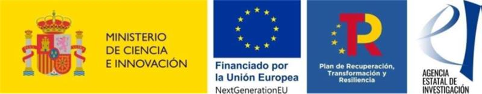

This code is © P. Sánchez and I. González, 2025, and it is made available under the GPL license enclosed with the software.
 
If you publish results using our algorithms, please acknowledge our work by citing the software directly as:
 
- Sánchez, P., González, I., Cortés, A., Carrillo, C., & Margalef, T. (2025). *Airborne Hyperspectral Data Processing* [Software]. Zenodo. [https://doi.org/10.5281/zenodo.14871861](https://doi.org/10.5281/zenodo.14871861)
 
This work is part of the project **CPP2021-008762** and has been financed by MCIN/AEI/10.13039/501100011033 and the European Union *NextGenerationEU*/PRTR.

# Airborne-Hyperspectral-Data-Processing
This Jupyter notebook processes remote sensing data to automatically extract wildfire perimeters. It generates remote sensing indices from both RGBN and LWIR images, specifically the Burned Area Index (BAI), Normalized Difference Vegetation Index (NDVI), and Normalized Difference Water Index (NDWI).

The burned area is then identified by analyzing the BAI and LWIR images. The methodology involves using high percentiles to detect hotspots in these images. Once hotspots are identified, the area of each is calculated. Hotspots that meet a minimum area threshold, based on the size of the largest hotspot (e.g., at least 1% of the largest hotspot's area), are retained. Smaller hotspots, which may be noise or artifacts from smoke, are discarded. Finally, a concave hull is used to derive the burned area from the retained hotspots in the LWIR and BAI images.
